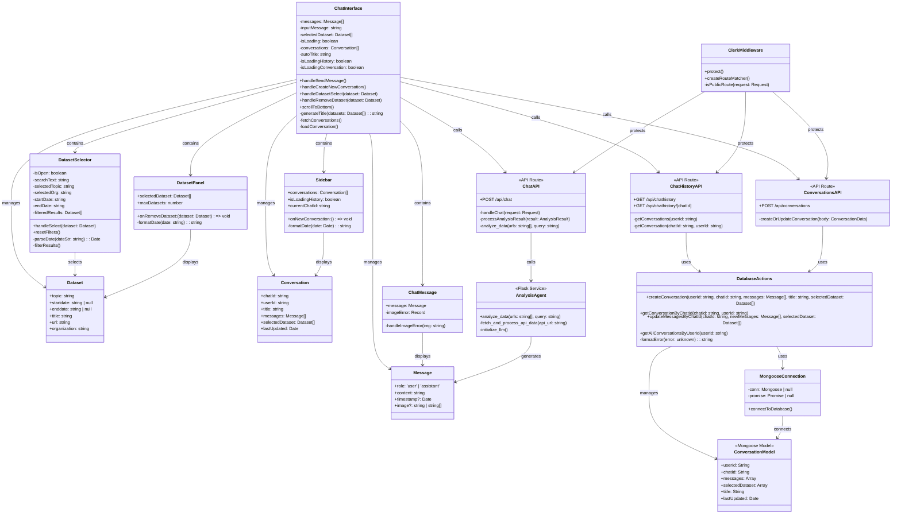
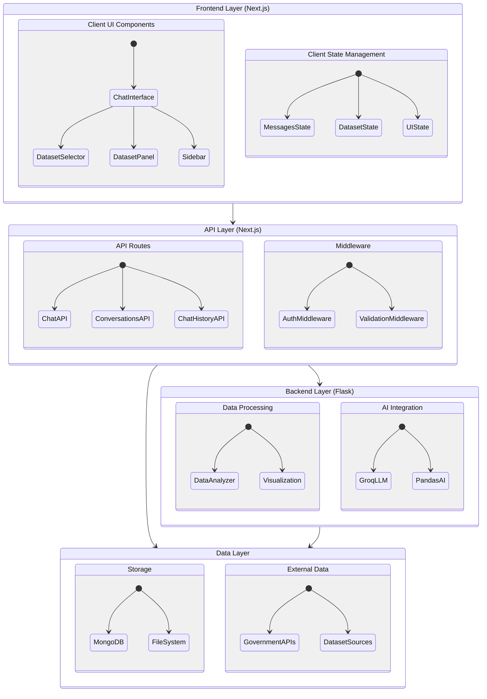
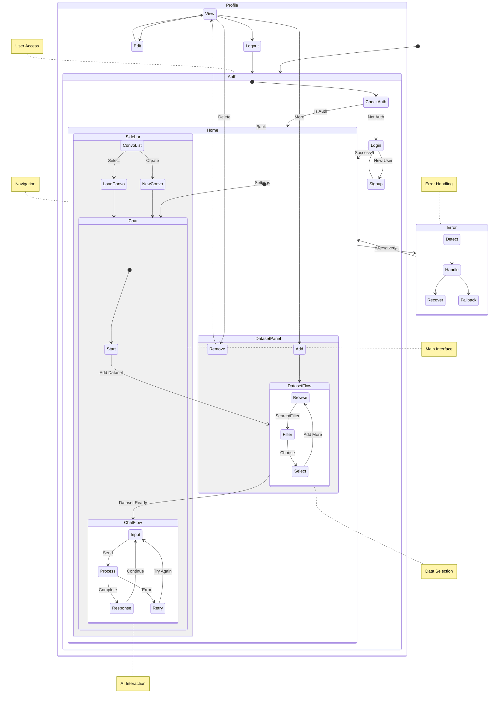
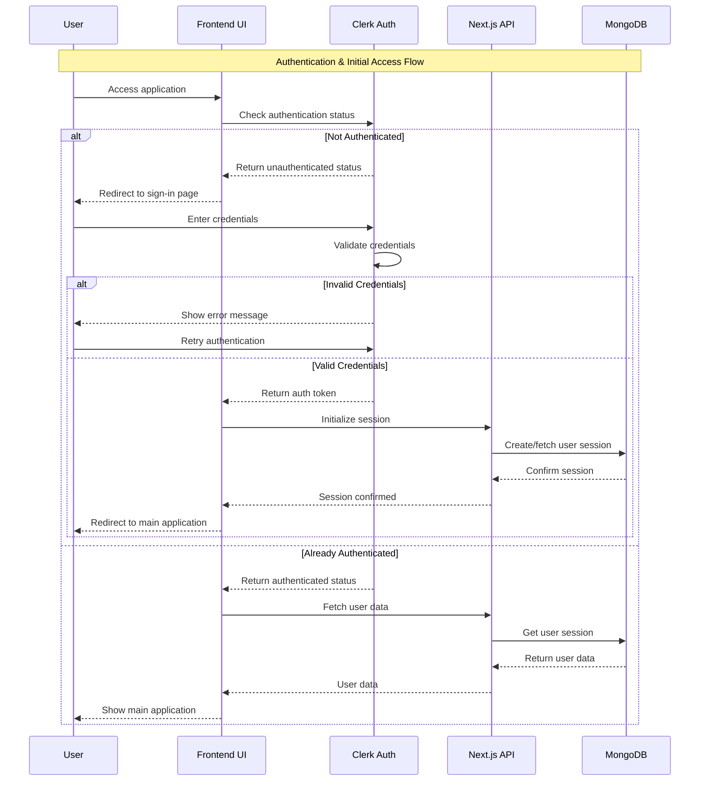
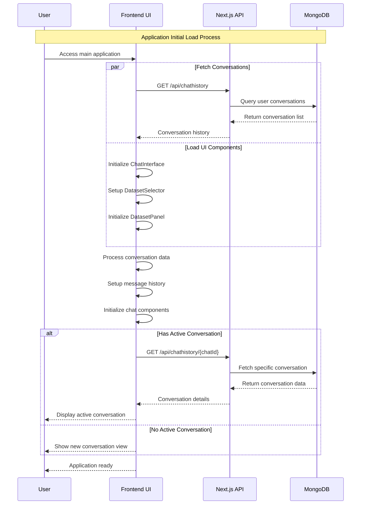
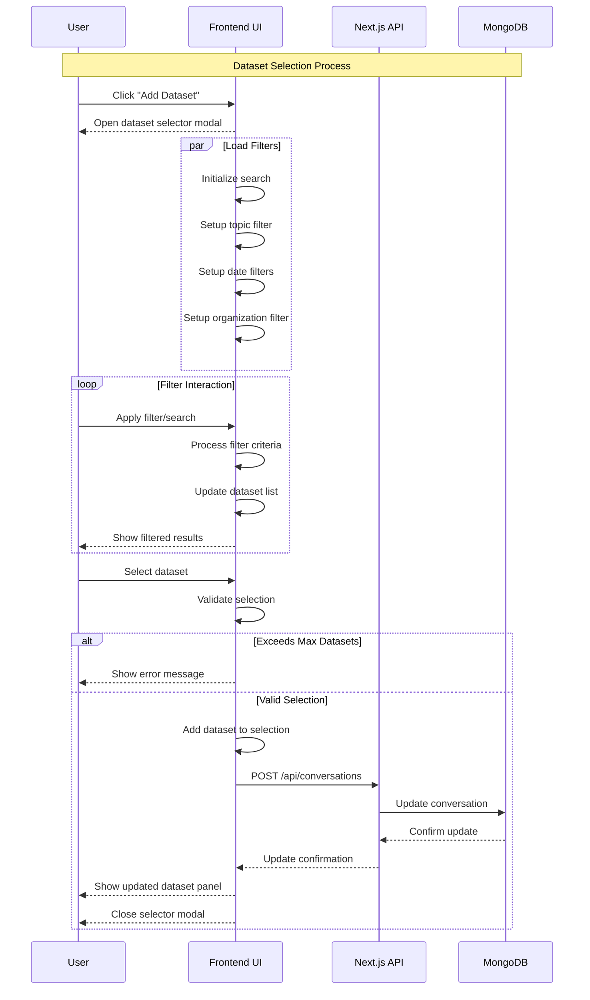
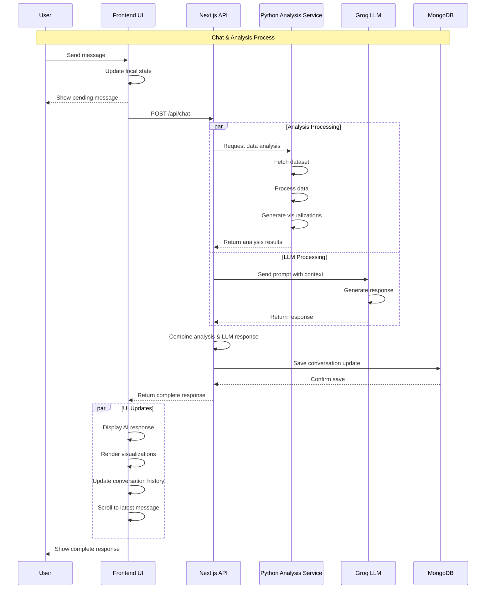
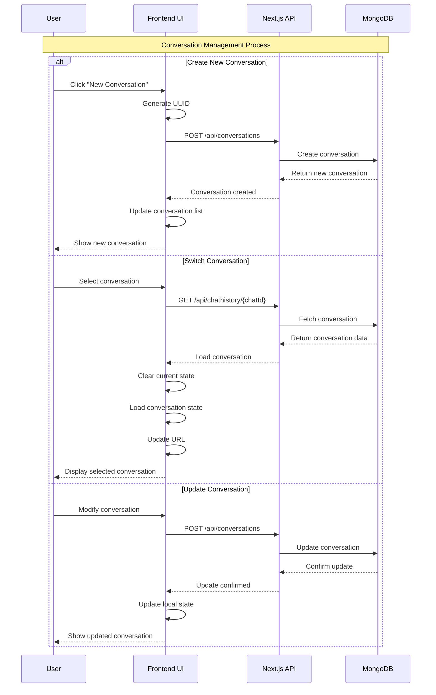
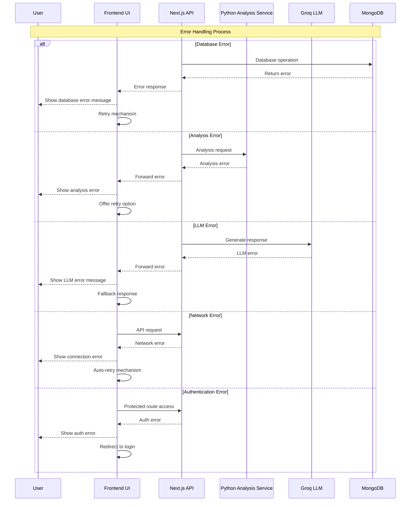

```mermaid
classDiagram
    %% Data Models
    class Message {
        +role: 'user' | 'assistant'
        +content: string
        +timestamp?: Date
        +image?: string | string[]
    }

    class Dataset {
        +topic: string
        +startdate: string | null
        +enddate: string | null
        +title: string
        +url: string
        +organization: string
    }

    class Conversation {
        +chatId: string
        +userId: string
        +title: string
        +messages: Message[]
        +selectedDataset: Dataset[]
        +lastUpdated: Date
    }

    %% Frontend Components
    class ChatInterface {
        -messages: Message[]
        -inputMessage: string
        -selectedDataset: Dataset[]
        -isLoading: boolean
        -conversations: Conversation[]
        -autoTitle: string
        -isLoadingHistory: boolean
        -isLoadingConversation: boolean
        +handleSendMessage()
        +handleCreateNewConversation()
        +handleDatasetSelect(dataset: Dataset)
        +handleRemoveDataset(dataset: Dataset)
        +scrollToBottom()
        -generateTitle(datasets: Dataset[]): string
        -fetchConversations()
        -loadConversation()
    }

    class DatasetSelector {
        -isOpen: boolean
        -searchText: string
        -selectedTopic: string
        -selectedOrg: string
        -startDate: string
        -endDate: string
        -filteredResults: Dataset[]
        +handleSelect(dataset: Dataset)
        +resetFilters()
        -parseDate(dateStr: string): Date
        -filterResults()
    }

    class DatasetPanel {
        +selectedDataset: Dataset[]
        +maxDatasets: number
        +onRemoveDataset: (dataset: Dataset) => void
        -formatDate(date: string): string
    }

    class Sidebar {
        +conversations: Conversation[]
        +isLoadingHistory: boolean
        +currentChatId: string
        +onNewConversation: () => void
        -formatDate(date: Date): string
    }

    class ChatMessage {
        +message: Message
        -imageError: Record<string, boolean>
        -handleImageError(img: string)
    }

    %% API Routes
    class ChatAPI {
        <<API Route>>
        +POST /api/chat
        -handleChat(request: Request)
        -processAnalysisResult(result: AnalysisResult)
        -analyze_data(urls: string[], query: string)
    }

    class ChatHistoryAPI {
        <<API Route>>
        +GET /api/chathistory
        +GET /api/chathistory/[chatId]
        -getConversations(userId: string)
        -getConversation(chatId: string, userId: string)
    }

    class ConversationsAPI {
        <<API Route>>
        +POST /api/conversations
        -createOrUpdateConversation(body: ConversationData)
    }

    %% Backend Services
    class DatabaseActions {
        +createConversation(userId: string, chatId: string, messages: Message[], title: string, selectedDataset: Dataset[])
        +getConversationByChatId(chatId: string, userId: string)
        +updateMessagesByChatId(chatId: string, newMessages: Message[], selectedDataset: Dataset[])
        +getAllConversationsByUserId(userId: string)
        -formatError(error: unknown): string
    }

    class MongooseConnection {
        -conn: Mongoose | null
        -promise: Promise<Mongoose> | null
        +connectToDatabase()
    }

    class ConversationModel {
        <<Mongoose Model>>
        +userId: String
        +chatId: String
        +messages: Array
        +selectedDataset: Array
        +title: String
        +lastUpdated: Date
    }

    %% Middleware
    class ClerkMiddleware {
        +protect()
        +createRouteMatcher()
        -isPublicRoute(request: Request)
    }

    %% Python Analysis Service
    class AnalysisAgent {
        <<Flask Service>>
        +analyze_data(urls: string[], query: string)
        -fetch_and_process_api_data(api_url: string)
        -initialize_llm()
    }

    %% Relationships
    ChatInterface --> Message : manages
    ChatInterface --> Dataset : manages
    ChatInterface --> Conversation : manages
    ChatInterface --> DatasetSelector : contains
    ChatInterface --> DatasetPanel : contains
    ChatInterface --> Sidebar : contains
    ChatInterface --> ChatMessage : contains
    ChatInterface --> ChatAPI : calls
    ChatInterface --> ChatHistoryAPI : calls
    ChatInterface --> ConversationsAPI : calls

    DatasetSelector --> Dataset : selects
    DatasetPanel --> Dataset : displays
    Sidebar --> Conversation : displays
    ChatMessage --> Message : displays

    ChatAPI --> AnalysisAgent : calls
    ChatHistoryAPI --> DatabaseActions : uses
    ConversationsAPI --> DatabaseActions : uses

    DatabaseActions --> MongooseConnection : uses
    DatabaseActions --> ConversationModel : manages
    MongooseConnection --> ConversationModel : connects

    ClerkMiddleware --> ChatAPI : protects
    ClerkMiddleware --> ChatHistoryAPI : protects
    ClerkMiddleware --> ConversationsAPI : protects

    AnalysisAgent --> Message : generates
```

```mermaid
%% High Level System Architecture
stateDiagram-v2
    direction TB

    state "Frontend Layer (Next.js)" as Frontend {
        state "Client UI Components" as UI {
            [*] --> ChatInterface
            ChatInterface --> DatasetSelector
            ChatInterface --> DatasetPanel
            ChatInterface --> Sidebar
        }
        state "Client State Management" as State {
            [*] --> MessagesState
            [*] --> DatasetState
            [*] --> UIState
        }
    }

    state "API Layer (Next.js)" as API {
        state "API Routes" as Routes {
            [*] --> ChatAPI
            [*] --> ConversationsAPI
            [*] --> ChatHistoryAPI
        }
        state "Middleware" as Mid {
            [*] --> AuthMiddleware
            [*] --> ValidationMiddleware
        }
    }

    state "Backend Layer (Flask)" as Backend {
        state "Data Processing" as Process {
            [*] --> DataAnalyzer
            [*] --> Visualization
        }
        state "AI Integration" as AI {
            [*] --> GroqLLM
            [*] --> PandasAI
        }
    }

    state "Data Layer" as Data {
        state "Storage" as Storage {
            [*] --> MongoDB
            [*] --> FileSystem
        }
        state "External Data" as External {
            [*] --> GovernmentAPIs
            [*] --> DatasetSources
        }
    }

    Frontend --> API
    API --> Backend
    API --> Data
    Backend --> Data
```

```mermaid
stateDiagram-v2
    [*] --> Auth
    
    state Auth {
        [*] --> CheckAuth
        CheckAuth --> Login: Not Auth
        CheckAuth --> Home: Is Auth
        Login --> Signup: New User
        Signup --> Login
        Login --> Home: Success
    }
    
    state Home {
        [*] --> Chat
        
        state Chat {
            [*] --> Start
            Start --> DatasetFlow: Add Dataset
            DatasetFlow --> ChatFlow: Dataset Ready
            
            state DatasetFlow {
                Browse --> Filter: Search/Filter
                Filter --> Select: Choose
                Select --> Browse: Add More
            }
            
            state ChatFlow {
                Input --> Process: Send
                Process --> Response: Complete
                Response --> Input: Continue
                Process --> Retry: Error
                Retry --> Input: Try Again
            }
        }
        
        state Sidebar {
            ConvoList --> NewConvo: Create
            ConvoList --> LoadConvo: Select
            NewConvo --> Chat
            LoadConvo --> Chat
        }
        
        state DatasetPanel {
            View --> Remove: Delete
            View --> Add: More
            Remove --> View
            Add --> DatasetFlow
        }
    }
    
    state Error {
        Detect --> Handle
        Handle --> Recover
        Handle --> Fallback
    }
    
    state Profile {
        View --> Edit
        View --> Logout
        Edit --> View
        Logout --> Auth
    }
    
    Home --> Error: Error Occurs
    Error --> Home: Resolved
    Home --> Profile: Settings
    Profile --> Home: Back

    note left of Auth: User Access
    note right of Chat: Main Interface
    note right of DatasetFlow: Data Selection
    note right of ChatFlow: AI Interaction
    note left of Sidebar: Navigation
    note left of Error: Error Handling
```

```mermaid
sequenceDiagram
    participant User
    participant UI as Frontend UI
    participant Auth as Clerk Auth
    participant API as Next.js API
    participant DB as MongoDB

    Note over User, DB: Authentication & Initial Access Flow

    User->>UI: Access application
    UI->>Auth: Check authentication status

    alt Not Authenticated
        Auth-->>UI: Return unauthenticated status
        UI-->>User: Redirect to sign-in page
        User->>Auth: Enter credentials
        Auth->>Auth: Validate credentials
        
        alt Invalid Credentials
            Auth-->>User: Show error message
            User->>Auth: Retry authentication
        else Valid Credentials
            Auth-->>UI: Return auth token
            UI->>API: Initialize session
            API->>DB: Create/fetch user session
            DB-->>API: Confirm session
            API-->>UI: Session confirmed
            UI-->>User: Redirect to main application
        end
    else Already Authenticated
        Auth-->>UI: Return authenticated status
        UI->>API: Fetch user data
        API->>DB: Get user session
        DB-->>API: Return user data
        API-->>UI: User data
        UI-->>User: Show main application
    end
```

```mermaid
sequenceDiagram
    participant User
    participant UI as Frontend UI
    participant API as Next.js API
    participant DB as MongoDB

    Note over User, DB: Application Initial Load Process

    User->>UI: Access main application
    
    par Fetch Conversations
        UI->>API: GET /api/chathistory
        API->>DB: Query user conversations
        DB-->>API: Return conversation list
        API-->>UI: Conversation history
    and Load UI Components
        UI->>UI: Initialize ChatInterface
        UI->>UI: Setup DatasetSelector
        UI->>UI: Initialize DatasetPanel
    end

    UI->>UI: Process conversation data
    UI->>UI: Setup message history
    UI->>UI: Initialize chat components
    
    alt Has Active Conversation
        UI->>API: GET /api/chathistory/{chatId}
        API->>DB: Fetch specific conversation
        DB-->>API: Return conversation data
        API-->>UI: Conversation details
        UI-->>User: Display active conversation
    else No Active Conversation
        UI-->>User: Show new conversation view
    end

    UI-->>User: Application ready
```

```mermaid
sequenceDiagram
    participant User
    participant UI as Frontend UI
    participant API as Next.js API
    participant DB as MongoDB

    Note over User, DB: Dataset Selection Process

    User->>UI: Click "Add Dataset"
    UI-->>User: Open dataset selector modal

    par Load Filters
        UI->>UI: Initialize search
        UI->>UI: Setup topic filter
        UI->>UI: Setup date filters
        UI->>UI: Setup organization filter
    end

    loop Filter Interaction
        User->>UI: Apply filter/search
        UI->>UI: Process filter criteria
        UI->>UI: Update dataset list
        UI-->>User: Show filtered results
    end

    User->>UI: Select dataset
    UI->>UI: Validate selection
    
    alt Exceeds Max Datasets
        UI-->>User: Show error message
    else Valid Selection
        UI->>UI: Add dataset to selection
        UI->>API: POST /api/conversations
        API->>DB: Update conversation
        DB-->>API: Confirm update
        API-->>UI: Update confirmation
        UI-->>User: Show updated dataset panel
        UI-->>User: Close selector modal
    end
```

```mermaid
sequenceDiagram
    participant User
    participant UI as Frontend UI
    participant API as Next.js API
    participant Python as Python Analysis Service
    participant LLM as Groq LLM
    participant DB as MongoDB

    Note over User, DB: Chat & Analysis Process

    User->>UI: Send message
    UI->>UI: Update local state
    UI-->>User: Show pending message

    UI->>API: POST /api/chat
    
    par Analysis Processing
        API->>Python: Request data analysis
        Python->>Python: Fetch dataset
        Python->>Python: Process data
        Python->>Python: Generate visualizations
        Python-->>API: Return analysis results
    and LLM Processing
        API->>LLM: Send prompt with context
        LLM->>LLM: Generate response
        LLM-->>API: Return response
    end

    API->>API: Combine analysis & LLM response
    API->>DB: Save conversation update
    DB-->>API: Confirm save

    API-->>UI: Return complete response
    
    par UI Updates
        UI->>UI: Display AI response
        UI->>UI: Render visualizations
        UI->>UI: Update conversation history
        UI->>UI: Scroll to latest message
    end

    UI-->>User: Show complete response
```

```mermaid
sequenceDiagram
    participant User
    participant UI as Frontend UI
    participant API as Next.js API
    participant DB as MongoDB

    Note over User, DB: Conversation Management Process

    alt Create New Conversation
        User->>UI: Click "New Conversation"
        UI->>UI: Generate UUID
        UI->>API: POST /api/conversations
        API->>DB: Create conversation
        DB-->>API: Return new conversation
        API-->>UI: Conversation created
        UI->>UI: Update conversation list
        UI-->>User: Show new conversation

    else Switch Conversation
        User->>UI: Select conversation
        UI->>API: GET /api/chathistory/{chatId}
        API->>DB: Fetch conversation
        DB-->>API: Return conversation data
        API-->>UI: Load conversation
        UI->>UI: Clear current state
        UI->>UI: Load conversation state
        UI->>UI: Update URL
        UI-->>User: Display selected conversation

    else Update Conversation
        User->>UI: Modify conversation
        UI->>API: POST /api/conversations
        API->>DB: Update conversation
        DB-->>API: Confirm update
        API-->>UI: Update confirmed
        UI->>UI: Update local state
        UI-->>User: Show updated conversation
    end
```

```mermaid
sequenceDiagram
    participant User
    participant UI as Frontend UI
    participant API as Next.js API
    participant Python as Python Analysis Service
    participant LLM as Groq LLM
    participant DB as MongoDB

    Note over User, DB: Error Handling Process

    alt Database Error
        API->>DB: Database operation
        DB-->>API: Return error
        API-->>UI: Error response
        UI-->>User: Show database error message
        UI->>UI: Retry mechanism

    else Analysis Error
        API->>Python: Analysis request
        Python-->>API: Analysis error
        API-->>UI: Forward error
        UI-->>User: Show analysis error
        UI->>UI: Offer retry option

    else LLM Error
        API->>LLM: Generate response
        LLM-->>API: LLM error
        API-->>UI: Forward error
        UI-->>User: Show LLM error message
        UI->>UI: Fallback response

    else Network Error
        UI->>API: API request
        API-->>UI: Network error
        UI-->>User: Show connection error
        UI->>UI: Auto-retry mechanism

    else Authentication Error
        UI->>API: Protected route access
        API-->>UI: Auth error
        UI-->>User: Show auth error
        UI->>UI: Redirect to login
    end
```

```mermaid
stateDiagram-v2
    [*] --> User

    state "Primary Actors" as Actors {
        state "User" as User
        state "Admin" as Admin
    }

    state "Authentication" as Auth {
        SignIn
        SignUp
        ManageProfile
        SignOut
    }

    state "Conversation Management" as ConvoMgmt {
        CreateNewConversation
        ViewConversationHistory
        SwitchConversations
        DeleteConversation
    }

    state "Dataset Operations" as DatasetOps {
        BrowseDatasets
        SearchDatasets
        FilterDatasets: By Topic/Date/Org
        SelectDataset
        ViewSelectedDatasets
        RemoveDataset
    }

    state "Chat Interactions" as ChatOps {
        SendMessage
        ViewResponses
        ViewAnalytics
        ExportResults
    }

    state "Data Analysis" as Analysis {
        ProcessDatasets
        GenerateVisualizations
        PerformAnalytics
        ProvideSuggestions
    }

    state "System Administration" as AdminOps {
        ManageUsers
        MonitorSystem
        ViewAnalytics
        ManageDatasets
    }

    %% User Relationships
    User --> Auth: Authenticates
    User --> ConvoMgmt: Manages
    User --> DatasetOps: Interacts
    User --> ChatOps: Performs
    
    %% Admin Relationships
    Admin --> Auth: Authenticates
    Admin --> AdminOps: Manages
    Admin --> Analysis: Monitors

    %% Extended Relationships
    ChatOps --> Analysis: Triggers
    DatasetOps --> Analysis: Feeds

    note right of User
        End user who interacts
        with the system for
        data analysis
    end note

    note right of Admin
        System administrator
        with elevated
        privileges
    end note

    note right of Auth
        Security and access
        control functions
    end note

    note right of ConvoMgmt
        Conversation tracking
        and management
    end note

    note right of DatasetOps
        Dataset selection and
        management functions
    end note

    note right of ChatOps
        Interactive chat and
        analysis operations
    end note

    note right of Analysis
        Core data processing
        and analysis engine
    end note

    note right of AdminOps
        System administration
        and monitoring
    end note
```
